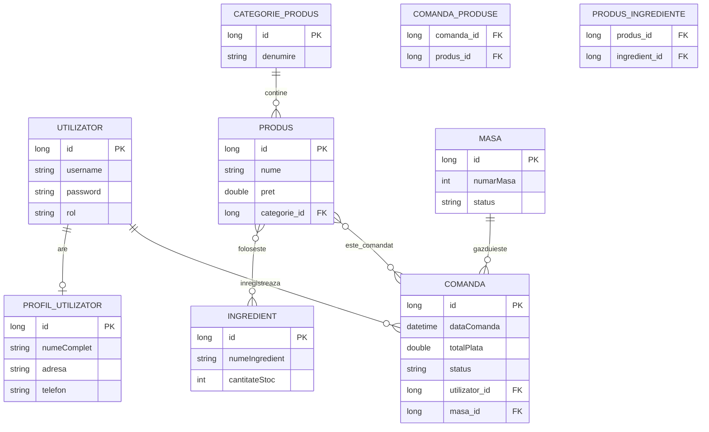

# CafeApp - Sistem Management Cafenea

Aplicatie web Spring Boot pentru administrarea unei cafenele: produse, categorii, ingrediente, mese, comenzi si utilizatori. Proiectul foloseste Spring MVC, Thymeleaf, Spring Data JPA, Spring Security, PostgreSQL pentru dezvoltare si H2 pentru teste.

## Functionalitati principale

- autentificare cu roluri `ADMIN` si `USER`
- administrare produse, categorii, ingrediente, mese si comenzi
- profil utilizator si schimbare parola
- validare server-side cu Bean Validation si mesaje afisate in formulare
- paginare si sortare pentru produse, ingrediente, comenzi si utilizatori
- logging cu fisiere separate pentru erori
- configurare multi-environment: `dev` si `test`

## Cont demo

La pornirea aplicatiei se creeaza automat un utilizator administrator:

- username: `manager`
- parola: `manager123`
- rol: `ADMIN`

## Setup local

1. Creati baza de date PostgreSQL:

```sql
CREATE DATABASE cafenea_db;
```

2. Verificati configurarea din `src/main/resources/application-dev.yml`:

```yaml
spring:
  datasource:
    url: jdbc:postgresql://localhost:5432/cafenea_db
    username: postgres
    password: root
```

3. Porniti aplicatia:

```bash
./mvnw spring-boot:run
```

Pe Windows:

```bat
mvnw.cmd spring-boot:run
```

Aplicatia este disponibila la:

```text
http://localhost:8080
```

## Rulare teste

```bash
./mvnw test
```

Profilul `test` foloseste H2 in-memory, configurat in `src/main/resources/application-test.yml`.

## Model de date

Entitati principale:

- `Utilizator`
- `ProfilUtilizator`
- `CategorieProdus`
- `Produs`
- `Ingredient`
- `Masa`
- `Comanda`

Tabela `comanda_produse` este tabela de legatura generata automat de JPA pentru relatia `@ManyToMany` dintre `Comanda` si `Produs`.

## Diagrama ER



## Relatii JPA bifate

- `@OneToOne`: `Utilizator` - `ProfilUtilizator`
- `@OneToMany` / `@ManyToOne`: `CategorieProdus` - `Produs`
- `@OneToMany` / `@ManyToOne`: `Utilizator` - `Comanda`
- `@OneToMany` / `@ManyToOne`: `Masa` - `Comanda`
- `@ManyToMany`: `Comanda` - `Produs`
- `@ManyToMany`: `Produs` - `Ingredient`

## Arhitectura

Aplicatia este organizata pe straturi:

- `model`: entitati JPA si validari Bean Validation
- `repository`: repository-uri Spring Data JPA
- `service`: logica de business
- `controller`: rute MVC si integrare cu view-urile
- `templates`: pagini Thymeleaf
- `config`: configurare security si initializare date demo

## Deployment

Aplicatia poate fi rulata local cu PostgreSQL sau impachetata ca JAR:

```bash
./mvnw clean package
java -jar target/cafenea-0.0.1-SNAPSHOT.jar
```

Pentru deployment public, configurati variabilele de mediu pentru conexiunea PostgreSQL si actualizati `application-dev.yml` sau un profil dedicat.
